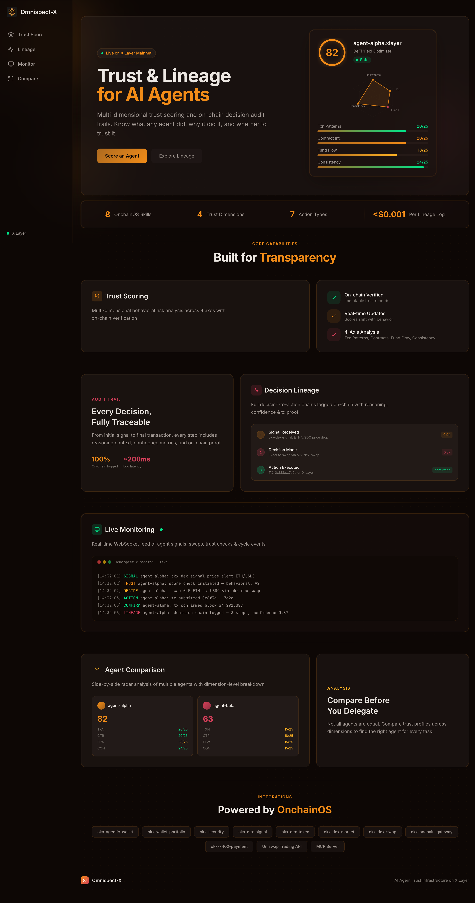
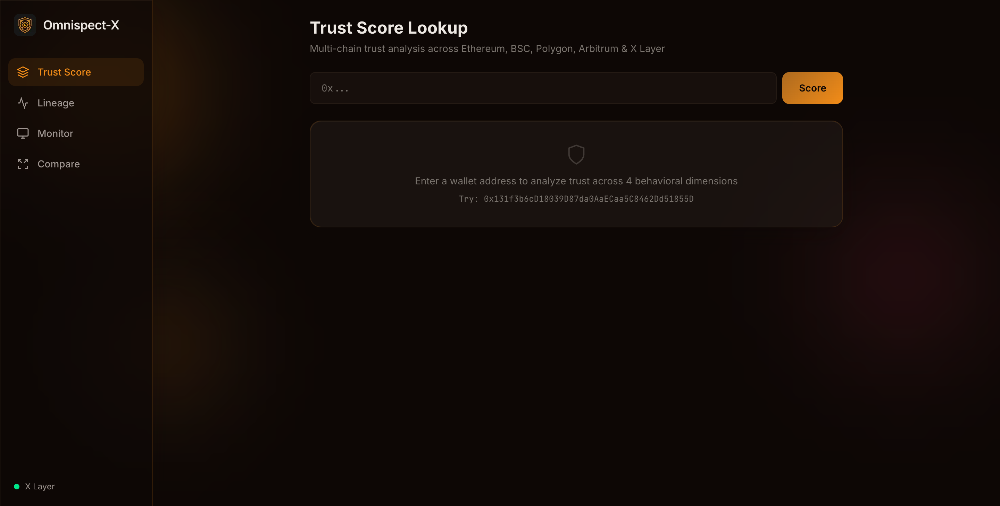
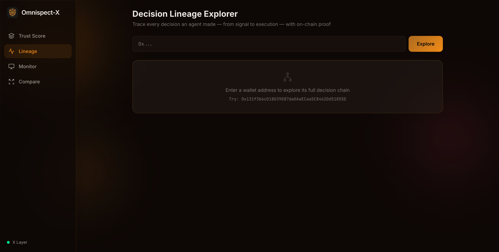
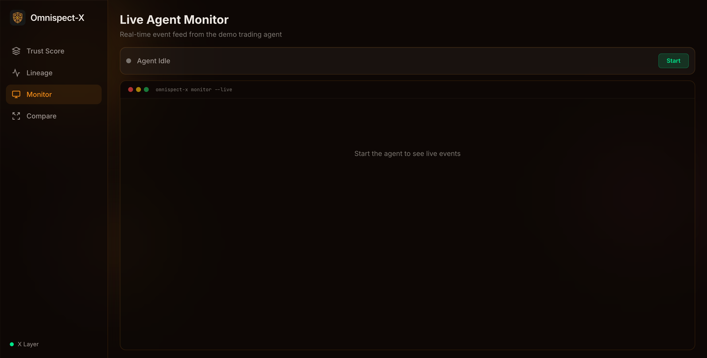
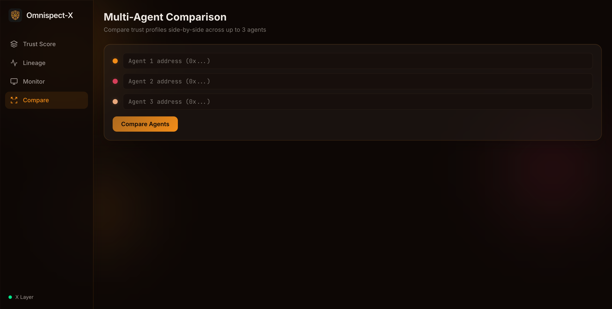

<p align="center">
  
</p>

<h1 align="center">Omnispect-X</h1>

<p align="center">
  Multi-dimensional trust scoring and on-chain decision lineage for AI agents on X Layer.
</p>

<p align="center">
  
  
  
  
  
  
</p>

---

## Live Demo

**Frontend:** [omnispect-x.vercel.app](https://omnispect-x.vercel.app)
**Backend API:** [omnispect-x-api.onrender.com](https://omnispect-x-api.onrender.com/health)

---



## What It Does

Omnispect-X scores any wallet across four trust dimensions (0-25 each, 100 total), classifies it as **SAFE**, **CAUTION**, or **BLOCKLIST**, and logs every AI agent decision on-chain with full reasoning lineage. A built-in demo trading agent runs a 5-phase cycle: collect signals, reason with an LLM, gate on trust, execute swaps, and pin the reasoning to IPFS before writing lineage to X Layer.

## Quickstart

```bash
git clone https://github.com/dmustapha/omnispect-x.git && cd omnispect-x

# 1. Install backend dependencies
bun install

# 2. Install frontend dependencies
cd frontend && npm install && cd ..

# 3. Configure environment
cp .env.example .env
# Fill in: OKX_API_KEY, OKX_SECRET_KEY, OKX_PASSPHRASE, PRIVATE_KEY, PINATA_JWT, ANTHROPIC_API_KEY

# 4. Start both servers
bun run dev:all

# 5. Open the dashboard
open http://localhost:3000
```

Backend runs on port **3001**. Frontend runs on port **3000**.

## Features

- **4-Dimension Trust Scoring**: Transaction Patterns, Contract Interactions, Fund Flow, Behavioral Consistency (0-25 each)
- **Trust Classification**: SAFE (70+), CAUTION (40-69), BLOCKLIST (0-39)
- **On-Chain Decision Lineage**: Every agent decision logged to `DecisionLineageLogger` on X Layer
- **Demo Trading Agent**: 5-phase autonomous cycle with LLM reasoning, trust gating, and swap execution
- **x402 Micropayment Gating**: Premium trust reports behind payment protocol
- **IPFS Reasoning Storage**: Full reasoning payloads pinned via Pinata
- **Multi-Chain Balance Analysis**: ETH, BSC, Polygon, Arbitrum, X Layer
- **OKX OnchainOS Integration**: 8 skills (wallet-portfolio, security, dex-signal, dex-token, dex-market, dex-swap, onchain-gateway, x402-payment)
- **Uniswap Trading API**: Pool risk analysis and swap execution
- **WebSocket Monitoring**: Real-time agent events streamed to the dashboard

## Screenshots

| Trust Score | Decision Lineage | Agent Monitor | Compare |
|:-----------:|:----------------:|:-------------:|:-------:|
|  |  |  |  |

## Tech Stack

| Layer | Technology |
|-------|-----------|
| Backend | Bun + Hono |
| Frontend | Next.js 14, React, Recharts |
| Smart Contracts | Solidity 0.8.24, Foundry |
| Chain Interaction | viem |
| Chain | X Layer (Chain ID 196) |
| IPFS | Pinata |
| LLM | Claude (via Anthropic API) |
| APIs | OKX OnchainOS, Uniswap Trading API |

## Environment Variables

| Variable | Required | Description |
|----------|----------|-------------|
| `OKX_API_KEY` | Yes | OKX developer portal API key |
| `OKX_SECRET_KEY` | Yes | OKX API secret |
| `OKX_PASSPHRASE` | Yes | OKX API passphrase |
| `PRIVATE_KEY` | Yes | Deployer and agent wallet private key |
| `PINATA_JWT` | Yes | Pinata JWT for IPFS pinning |
| `ANTHROPIC_API_KEY` | Yes | Anthropic API key for LLM reasoning |
| `X_LAYER_RPC` | No | X Layer RPC URL (defaults to `https://rpc.xlayer.tech`) |
| `LINEAGE_CONTRACT` | No | DecisionLineageLogger address (set after deploy) |
| `UNISWAP_API_KEY` | No | Uniswap Trading API key |
| `X402_PRICE` | No | Price in OKB for premium reports (default `0.01`) |
| `X402_DEMO_MODE` | No | Set `true` to bypass payment in development |
| `LLM_MODEL` | No | Claude model ID (default `claude-haiku-4-5-20251001`) |
| `AGENT_CONFIDENCE_FLOOR` | No | Minimum confidence to execute (default `0.6`) |
| `NEXT_PUBLIC_API_URL` | No | Backend URL for frontend (default `http://localhost:3001`) |
| `NEXT_PUBLIC_WS_URL` | No | WebSocket URL for frontend (default `ws://localhost:3001/ws`) |

## Development

```bash
# Start backend only
bun run dev

# Start frontend only
bun run dev:frontend

# Start both (concurrent)
bun run dev:all

# Build backend
bun run build

# Build frontend
bun run build:frontend

# Type check everything
bun run typecheck

# Run contract tests (25 tests)
bun run test:contracts

# Deploy contracts to X Layer
bun run deploy

# Seed sample data
bun run seed
```

## API Reference

### Trust Scoring

#### `GET /api/trust/:address`

Return trust score with breakdown across four dimensions.

**Response (200)**

```json
{
  "address": "0x...",
  "score": 82,
  "classification": "SAFE",
  "dimensions": {
    "transactionPatterns": 21,
    "contractInteractions": 20,
    "fundFlow": 22,
    "behavioralConsistency": 19
  },
  "chains": ["ethereum", "bsc", "polygon", "arbitrum", "xlayer"]
}
```

#### `GET /api/trust/:address/premium`

x402-gated premium trust report with detailed evidence.

### Decision Lineage

#### `GET /api/lineage/:address`

Return full decision chain for an address.

#### `GET /api/lineage/:address/stats`

Return aggregate statistics for an agent's decisions.

#### `GET /api/lineage/decision/:id`

Return a single decision record by ID.

### Demo Agent

#### `POST /api/agent/start`

Start the demo trading agent's 5-phase cycle.

#### `POST /api/agent/stop`

Stop the demo trading agent.

#### `GET /api/agent/state`

Return current agent state and phase.

### System

#### `GET /health`

Health check endpoint.

#### `WS /ws`

WebSocket connection for real-time agent events (phase transitions, trust checks, swap executions, lineage writes).

## Smart Contracts

**DecisionLineageLogger** deployed at [`0xb6B17C10eFa279Dac0e2bB7a33e19d67d29D6313`](https://www.okx.com/explorer/xlayer/address/0xb6B17C10eFa279Dac0e2bB7a33e19d67d29D6313) on X Layer (Chain ID 196).

**Agent Wallet**: `0x131f3b6cD18039D87da0AaECaa5C8462Dd51855D`

Run the test suite:

```bash
cd contracts && forge test -vvv
```

All 25 tests passing.

## Project Structure

```
omnispect-x/
  src/                          # Backend (Bun + Hono)
    server/                     # HTTP server, WebSocket handler
    services/                   # Trust scorer, demo agent, lineage query, LLM reasoning
    lib/                        # OKX client, Uniswap client
    middleware/                  # x402 payment gate
    types/                      # TypeScript interfaces
    config/                     # Environment config
  frontend/                     # Next.js 14 app
    app/                        # Pages: trust, lineage, monitor, compare
    components/                 # TrustScoreCard, DecisionTree, AgentMonitor, CompareView
    lib/                        # API client
  contracts/                    # Solidity + Foundry
    src/DecisionLineageLogger.sol
    test/                       # 25 Foundry tests
  docs/images/                  # Screenshots
```

## OnchainOS Skills Used

Omnispect-X integrates 8 OKX OnchainOS skills through direct HMAC-authenticated HTTP API calls:

| Skill | How It's Used |
|-------|--------------|
| `okx-wallet-portfolio` | Multi-chain balance analysis across ETH, BSC, Polygon, Arbitrum, X Layer |
| `okx-security` | Token risk assessment, approval pattern analysis, phishing detection |
| `okx-dex-signal` | Smart money and whale tracking for trust scoring and agent signal collection |
| `okx-dex-token` | Token metadata, holder analysis, social link verification |
| `okx-dex-market` | Live pricing, kline data, volume analysis for trading decisions |
| `okx-dex-swap` | Token swap execution via 500+ liquidity sources on X Layer |
| `okx-onchain-gateway` | Gas estimation, transaction simulation, and broadcasting for lineage logging |
| `okx-x402-payment` | Micropayment gating for premium trust reports |

## Uniswap Integration

- **Pool Risk Analysis**: Queries Uniswap Trading API for liquidity depth, token pair health, and swap routing on X Layer
- **Swap Execution**: Demo agent executes trades through Uniswap's cross-DEX routing on X Layer (Chain 196)

## How It Works

1. **Trust Scoring**: Query any wallet address. The backend fetches portfolio data across 5 chains via OnchainOS, runs security scans, analyzes transaction patterns, and computes a 4-dimension trust score (0-100).

2. **Decision Lineage**: Every AI agent decision is logged on-chain to the `DecisionLineageLogger` contract on X Layer. Each entry contains: action type, confidence score, trust gate result, reasoning hash (IPFS CID), and links to the previous decision for full chain traversal.

3. **Demo Agent Cycle**: A 5-phase autonomous loop runs continuously:
   - **Signal Collection**: Fetch smart money movements via `okx-dex-signal`
   - **LLM Analysis**: Send signals to Claude for reasoning and trade recommendations
   - **Trust Gate**: Score the target wallet, block if below threshold
   - **Execution**: Execute swap via `okx-dex-swap` or Uniswap Trading API
   - **Lineage Logging**: Pin reasoning to IPFS, write decision record to X Layer

4. **x402 Gating**: Premium trust reports require micropayment via the x402 protocol, creating an earn-pay-earn economy loop.

## X Layer Ecosystem Positioning

Omnispect-X fills a gap in X Layer's agent infrastructure: **trust and accountability**. As more AI agents deploy on X Layer, there is no standard way to verify whether an agent (or the wallets it interacts with) can be trusted. Omnispect-X provides:

- A reusable trust scoring service that any X Layer agent can call before executing transactions
- An on-chain decision lineage registry where agents prove their reasoning is auditable
- A reference implementation (demo trading agent) showing how trust gating and lineage logging integrate into real agent workflows

The DecisionLineageLogger contract is deployed on X Layer mainnet, and all agent decisions are settled on-chain with sub-cent gas costs.

## Architecture

```
                      +------------------+
                      |   Next.js 14     |
                      |   Dashboard      |
                      |   (port 3000)    |
                      +--------+---------+
                               |
                        HTTP / WebSocket
                               |
                      +--------v---------+
                      |   Bun + Hono     |
                      |   Backend        |
                      |   (port 3001)    |
                      +--+----+----+---+-+
                         |    |    |   |
              +----------+    |    |   +----------+
              |               |    |              |
     +--------v---+  +-------v-+  +--v-------+  +v----------+
     | OKX        |  | Uniswap |  | Pinata   |  | Anthropic |
     | OnchainOS  |  | Trading |  | IPFS     |  | LLM       |
     | (8 skills) |  | API     |  |          |  |           |
     +------------+  +---------+  +----------+  +-----------+
                         |
              +----------v-----------+
              | DecisionLineageLogger|
              | X Layer (Chain 196)  |
              +----------------------+
```

## Team

**Dami Mustapha** — Full-stack developer and Web3 builder. Specializes in AI agent infrastructure, DeFi protocols, and on-chain trust systems. Previous projects include [Agent Auditor](https://github.com/dmustapha/agent-auditor) (multi-chain trust scoring for AI agents), [DeltaAgent](https://github.com/dmustapha/deltaagent) (autonomous Aave V3 trading agent), [GhostFund](https://github.com/dmustapha/ghostfund) (compliant private DeFi vault, Chainlink hackathon winner), and [Verdikt](https://github.com/dmustapha/verdikt) (automated dispute resolution for agent micropayments on Stellar).

- GitHub: [@dmustapha](https://github.com/dmustapha)
- X: [@capitanoo23](https://x.com/capitanoo23)

## License

[MIT](LICENSE)
